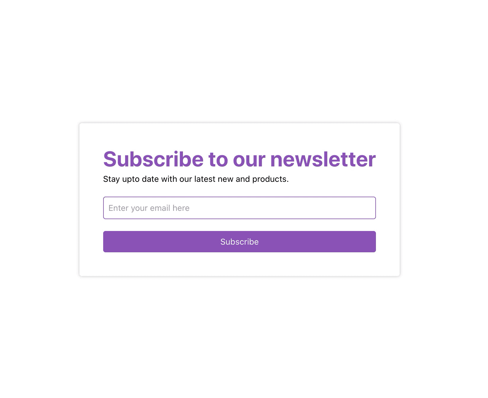

<h1 align="center">Newsletter Subscription :newspaper_roll:</h1>

<p align="center">
A Full Stack Web App demonstrating a form which allows users to subscribe to newsletter via their email and view list of all subscribers. The subscriptions get recorded in a database and accessible via a RESTFul JSON API.
</p>



## Tech Stack Used :hammer_and_wrench:

### Front End

- Language: TypeScript
- Technology: React JS
- UI Framework: Tailwind CSS
- State Management: Redux
- Form Library: React Hooks Form
- Linter: ESLint
- Formatted: Prettier

### Back End

- Language: TypeScript
- Technology: Express JS
- ENV Vars Validator: JOI
- Security Module: Helmet
- Request Params Validator: Express Validator
- Database: MongoDB
- ODM Library: Mongoose
- Linter: ESLint
- Formatted: Prettier

## Steps to run :rocket:

```bash
  # clone the repository
  git clone https://github.com/vinaysharma14/newletter-subscription

  # navigate to the project
  cd newsletter-subscription

  # open server, install dependencies and run
  cd client
  npm install
  npm run

  # open client and install dependencies and run
  cd server
  npm install
  npm run
```
